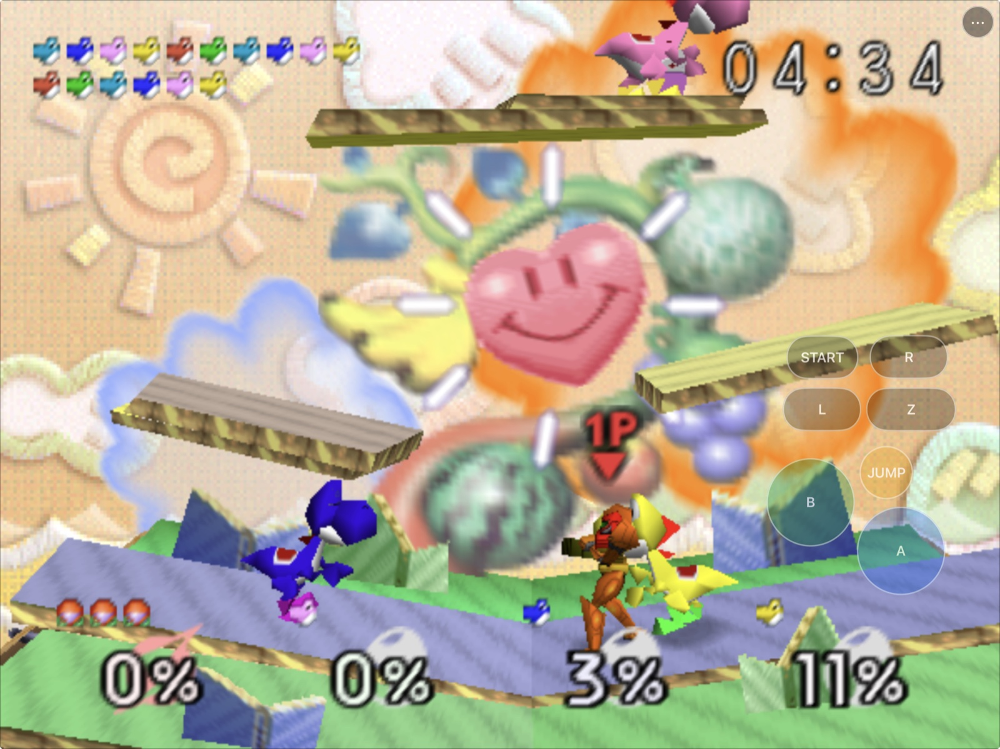
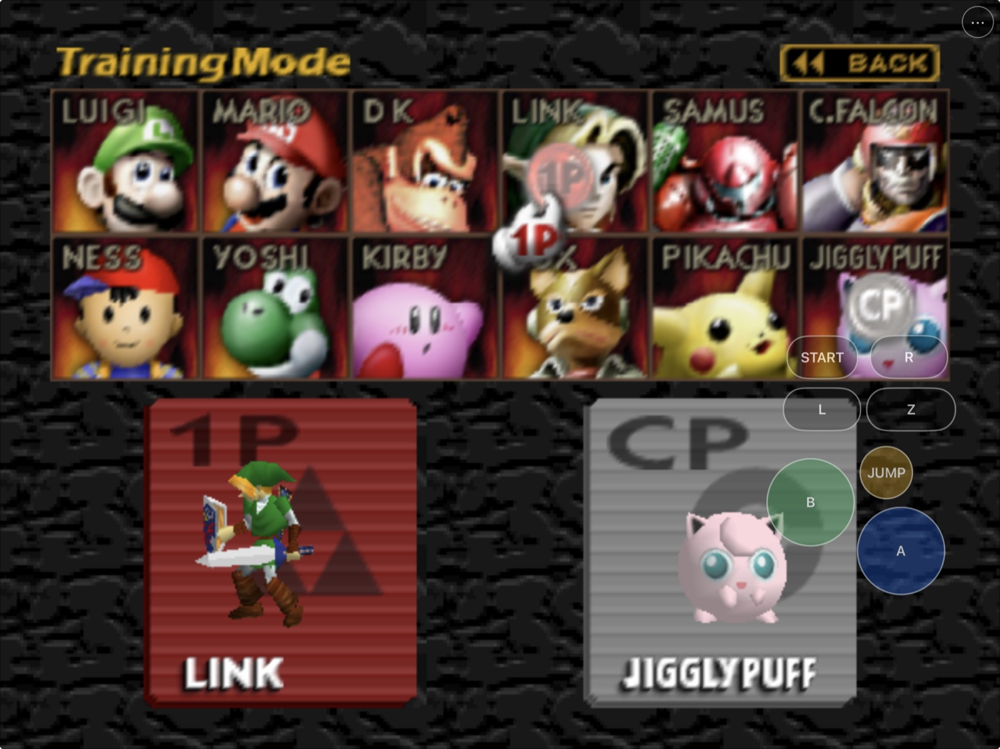
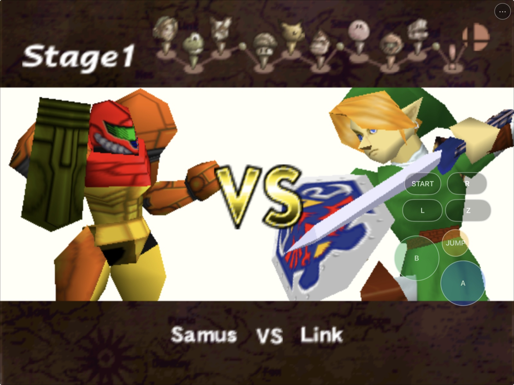
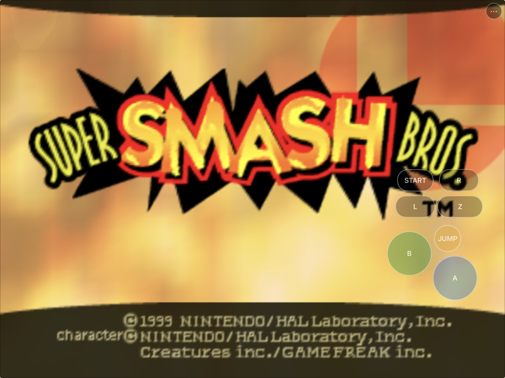
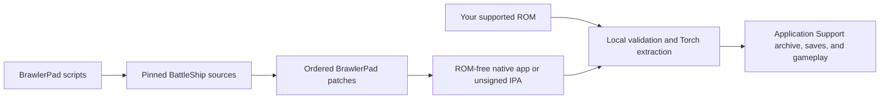

# BrawlerPad

<p align="center">
  <strong>Super Smash Bros. 64 rebuilt as a native Apple-platform port.</strong><br>
  Metal rendering, Files-based ROM setup, physical-controller plumbing, and
  floating iPhone/iPad touch controls.
</p>

<p align="center">
  
  
  
  
</p>



BrawlerPad is an unofficial native iOS, iPadOS, and Apple Silicon macOS
porting project based on reverse-engineered game code. It is not a
general-purpose Nintendo 64 emulator and is not affiliated with or endorsed by
Nintendo. No ROM, extracted game-asset bundle, or playable archive is included.
Users must provide their own legally obtained game data. This repository contains the
Apple integration and reproducible build scripts; read the scoped
[rights and licensing boundary](RIGHTS_AND_LICENSES.md) before building or
sharing a binary.

## Install status

| Option | Status | What to do |
|---|---|---|
| Local Apple Silicon macOS app | **Available now** | Run `scripts/build-macos-app.sh`; the ROM-free app prompts for your supported ROM on first launch. |
| iPhone/iPad Simulator | **Available now** | Run `scripts/build-ios-simulator.sh`, install with `simctl`, then select your ROM through Files. |
| Developer-preview `.ipa` | **Built and audited; publication pending** | `BrawlerPad-0.1.0-preview.1-unsigned.ipa` is a ROM-free arm64 build with SHA-256 `d41eeffc91f9440b22d268e69e39150aacd5ebbbf4a5cd9cbe960982e2c4531d`. It is unsigned and requires re-signing before device installation; a download link will be added when it is published. |
| Signed physical-device build | **Locally verified** | A development-signed build installs and runs on registered iPhone and iPad hardware; public signing/distribution is not included. |
| App Store / TestFlight | **Not announced** | No public store listing or TestFlight exists. |

## Get started

You need an Apple Silicon Mac, Xcode and its command-line tools, the dependencies
listed in [the build guide](docs/BUILDING.md), and your own legally obtained
supported US ROM. Then run:

```sh
git clone https://github.com/chrissotraidis/brawlerpad.git
cd brawlerpad
scripts/clone-sources.sh

# Choose one or more targets.
scripts/build-macos-app.sh
scripts/build-ios-simulator.sh
scripts/build-ios-device.sh
scripts/package-ios.sh
```

All generated source trees, build products, packages, ROMs, and extracted game
archives stay outside Git. Simulator and physical-device installation commands
are documented in [docs/BUILDING.md](docs/BUILDING.md). Before publishing or
sharing a binary, follow the [release checklist](docs/RELEASE_CHECKLIST.md).

## Status

The selected game core is [BattleShip](https://github.com/JRickey/BattleShip).
Pinned upstream sources plus the ordered BrawlerPad patches build native Metal
apps for Apple Silicon macOS, iPhone, and iPad. The port validates a locally
provided ROM, performs linked Torch extraction, mounts the generated archive,
persists saves/settings, and supports both physical and native touch-controller
input through the same SDL/ControlDeck path.

The current touch model follows how Smash 64 is actually played. The unused
D-pad is gone, the left 47 percent of the screen creates a fresh analog stick
at the initiating touch, and the right side provides Z, A, B, Jump, L, R, and
Start so movement can be combined with shields, rolls, grabs, attacks, and
aerials. Short taps and stick flicks are retained across the game poll boundary,
and the settings sidebar now sizes itself to its labels instead of clipping.

The same development-signed arm64 build is installed on a physical iPad Pro
and iPhone 14. The iPhone launch log shows a stable ~16.7 ms frame cadence,
zero post-start audio underruns, and a maintained SDL queue after the mobile
480p performance profile, startup priming, and queue-watermark recovery were
enabled. Earlier launches on both devices also confirmed ROM/archive loading,
32 kHz music/SFX initialization, touch-controller assignment, configuration,
and save creation. The runtime recovers a persisted Null audio backend and can
safely migrate a ROM accidentally copied to the old support-path location.

The repository still distributes no signed app, ROM, save, or playable archive.
Hands-on acceptance remains open for confirming uninterrupted audio during a
long match, simultaneous multitouch feel, the pause-only Reset action,
rotation/safe areas, physical-controller gameplay, and real interruption or
headphone/Bluetooth route changes. See [current status](docs/STATUS.md) and
[testing evidence](docs/TESTING.md) for the exact boundary.

## Repository boundary

`ref/` is ignored local storage for upstream research checkouts and a
user-supplied ROM. It is never packaged. Exact upstream revisions are recorded
in [docs/DEPENDENCIES.md](docs/DEPENDENCIES.md) and fetched with:

```sh
scripts/clone-sources.sh
```

The repository safety gate rejects ROMs, extracted archives, applications,
packages, signing material, large generated files, and likely credentials:

```sh
scripts/check-repo-safety.sh
```

## Baseline macOS build

Install the documented tools and libraries, then pass an exact supported US
ROM to the baseline script:

```sh
brew install cmake ninja python@3.11 glew libzip tinyxml2 nlohmann-json spdlog fmt dylibbundler
"$(brew --prefix python@3.11)/bin/python3.11" -m pip install --user Pillow
scripts/build-macos-baseline.sh /absolute/path/to/your/rom.n64
```

The ROM is hash-checked and linked only into the ignored BattleShip research
checkout. It is never copied into this repository's tracked project or an app
package. Full details are in [docs/BUILDING.md](docs/BUILDING.md).

Build and audit the branded, ROM-free macOS package with:

```sh
scripts/build-macos-app.sh
```

This produces ignored `BrawlerPad.app` and `BrawlerPad.dmg` artifacts under
`ref/BattleShip/dist/`. The app is ad-hoc signed, uses bundle identifier
`com.brawlerpad.app.macos`, and prompts for a supported ROM on first launch;
no ROM or playable generated archive is bundled. The build audit verifies the
app, mounts the DMG read-only, and audits the contained app again.

## iPhone and iPad builds

After fetching the pinned sources and patches, build the unsigned arm64 app:

```sh
scripts/build-ios-simulator.sh
```

The resulting `BrawlerPad.app` supports both iPhone and iPad simulator device
families. On first launch, choose your legally obtained supported ROM through
Files; BrawlerPad uses only a temporary validated copy to generate resources
under Application Support, then deletes that copy. See
[docs/BUILDING.md](docs/BUILDING.md) for install and launch commands.

The in-game Settings → Input Mappings page can enable or hide the touch
overlay, change its opacity, and open the layout editor. Phone and tablet
layouts persist separately. A physical controller hides gameplay controls by
default while leaving the native menu button available. The current defaults
reserve the left side for a per-touch floating analog stick and group all
buttons on the right for simultaneous movement and action input.

On iPhone, Settings uses a compact section picker instead of the tablet
sidebar, keeps the content at full width, and supports vertical finger-drag
scrolling anywhere in the active settings pane. iPad retains the persistent
sidebar and its larger tablet scale.

Build and audit an unsigned arm64 iPhoneOS app, then create the reproducible
ROM-free proof IPA:

```sh
scripts/build-ios-device.sh
scripts/package-ios.sh
```

This default artifact is an unsigned reproducibility proof: its Mach-O omits a
UUID and is not a runnable device app even after signing. For a local
development-signed install, build the runtime variant instead:

```sh
BRAWLERPAD_REPRODUCIBLE_DEVICE_LINK=OFF scripts/build-ios-device.sh
```

That variant retains the UUID required by iOS and can then be signed with the
installer's own identity and provisioning profile. Neither workflow embeds
project signing material. Packaging includes project rights notices and
discovered source/dependency licenses, then reruns the strict package audit.

## First launch

BrawlerPad never downloads or bundles game data.

1. Launch the app and choose **Select ROM**.
2. Pick your legally obtained supported US ROM through Files or the macOS file
   picker.
3. BrawlerPad copies it into temporary app-controlled storage and validates its
   exact size and hash.
4. Linked Torch generates `BrawlerPad.o2r` under Application Support.
5. The temporary import is deleted and the native Metal game launches.

The supported ROM SHA-1 is
`e2929e10fccc0aa84e5776227e798abc07cedabf`. Invalid files are rejected without
altering the source document or leaving temporary copies behind.

## Touch controls

- **Left:** touch anywhere in the left 47 percent to create a floating analog
  stick; it tracks that contact and disappears on release.
- **Right:** Z, A, B, one large Jump target, and an independent Start/R/L rail.
- **Pause:** a red Reset pill appears only while a battle is paused and sends
  the game's native A+B+Z+R reset chord with one touch.
- **Menu:** the persistent `•••` button remains available when gameplay controls
  are hidden.
- **Customize:** Settings → Input Mappings changes opacity and opens the editor
  for move, 70–150% resize, hide/show, reset, and save.
- **Profiles:** phone, landscape tablet, and tall/portrait tablet layouts persist
  separately.
- **Controllers:** gameplay touch controls hide automatically by default when a
  physical controller is connected; this can be disabled.

Every touch target feeds the same normalized SDL/ControlDeck player-one path as
physical controllers. Opening the native menu cancels held input and removes the
gameplay overlay until the menu closes.

## Current screenshots

<table>
  <tr>
    <td width="50%">
      
    </td>
    <td width="50%">
      
    </td>
  </tr>
  <tr>
    <td align="center"><strong>Ready to fight</strong><br>Character select remains fully visible behind the touch overlay.</td>
    <td align="center"><strong>Native match flow</strong><br>Menus, stages, and gameplay run through the Apple-platform build.</td>
  </tr>
  <tr>
    <td colspan="2">
      
    </td>
  </tr>
  <tr>
    <td colspan="2" align="center"><strong>First launch to match</strong><br>The app guides local ROM setup, then keeps its controls close at hand.</td>
  </tr>
</table>

The hero and gallery captures use locally supplied game data. No ROM, save, or
playable archive is included in this repository.

## What works

| Area | Current result |
|---|---|
| Native apps | Apple Silicon macOS, arm64 iOS Simulator, and unsigned arm64 iPhoneOS builds pass |
| Rendering | Native Metal reaches menus, character/stage selection, matches, pause, and populated results |
| Game setup | Files picker, exact ROM validation, in-process extraction, cleanup, and local archive mount pass |
| Touch | Floating analog plus chord-friendly right-side controls, editor, separate profiles, and full single-contact VS flows pass |
| Audio | Physical iPhone telemetry holds the queue above its watermark with zero post-start underruns; long-play and route-change listening remain open |
| Saves/settings | Creation, relaunch, backgrounding, and repeated in-place app updates preserve valid content |
| Lifecycle | iPhone/iPad foreground recovery plus synthetic interruption and low-memory dispatch pass |
| Packaging | ROM-free macOS app/DMG and deterministic unsigned IPA pass strict privacy/signing audits |

Hardware-only acceptance still covers long-play audio/interruption/routes,
true simultaneous-multitouch and pause-reset feel, rotation/safe areas, and
physical-controller gameplay/reconnect. Signed iPhone/iPad install, data
generation, audio initialization, and live-process proof pass. See
[docs/TESTING.md](docs/TESTING.md) for the evidence boundary.

## Reproducible and ROM-free



The compile and package steps never read or embed your ROM. The package audits
reject ROM extensions, playable archives, saves, credentials, profiles,
certificates, private keys, personal paths, and unintended generated files.
A fresh remote clone has replayed every pinned source and maintained patch,
then built and audited the macOS app/DMG, arm64 Simulator app, generic arm64
iPhoneOS app, and two byte-identical unsigned IPAs.

## Frequently asked questions

<details>
<summary><strong>Where is the IPA?</strong></summary>

The first ROM-free developer-preview IPA has been built and audited locally as
`BrawlerPad-0.1.0-preview.1-unsigned.ipa` (SHA-256
`d41eeffc91f9440b22d268e69e39150aacd5ebbbf4a5cd9cbe960982e2c4531d`). It is
not published for download yet. The unsigned IPA must be re-signed with an
Apple identity before installation on a standard device.
</details>

<details>
<summary><strong>Does this repository include the game or a ROM?</strong></summary>

No. You must provide your own legally obtained supported ROM. Do not open issues
requesting game data, generated archives, or download links.
</details>

<details>
<summary><strong>Does audio work?</strong></summary>

Yes. The native pipeline initializes at 32 kHz and loads the game music and SFX
assets on physical iPhone and iPad. On iPhone, the current build primes two
device buffers before playback, refills toward a software watermark, and logs
zero post-start underruns while frame pacing holds near 16.7 ms. Long-match
listening and real headphone/Bluetooth interruption tests remain open.
</details>

<details>
<summary><strong>Does it support controllers?</strong></summary>

Yes at the architecture and detection level: SDL mappings and the normalized
ControlDeck path are included, and Simulator controller detection/automatic
touch hiding work. Actual physical-controller gameplay and reconnect remain a
hardware acceptance item.
</details>

<details>
<summary><strong>Is this an App Store or TestFlight release?</strong></summary>

No. App Store, TestFlight, AltStore PAL, and other distribution paths require
separate signing, review, account, and release work.
</details>

## Project map

| Path | Purpose |
|---|---|
| [`scripts/clone-sources.sh`](scripts/clone-sources.sh) | Fetch exact upstream pins and replay maintained patches |
| [`scripts/build-macos-app.sh`](scripts/build-macos-app.sh) | Build and audit the Apple Silicon app and DMG |
| [`scripts/build-ios-simulator.sh`](scripts/build-ios-simulator.sh) | Build the universal iPhone/iPad Simulator app |
| [`scripts/build-ios-device.sh`](scripts/build-ios-device.sh) | Build and audit the unsigned arm64 iPhoneOS app |
| [`scripts/package-ios.sh`](scripts/package-ios.sh) | Create and audit the deterministic unsigned IPA |
| [`scripts/check-repo-safety.sh`](scripts/check-repo-safety.sh) | Reject game data, secrets, signing material, and generated products |
| [`patches/`](patches/) | Ordered BrawlerPad changes applied to pinned upstream sources |
| [`docs/PLAN.md`](docs/PLAN.md) | Architecture and milestone plan |
| [`docs/ARCHITECTURE.md`](docs/ARCHITECTURE.md) | Runtime and platform boundaries |
| [`docs/BUILDING.md`](docs/BUILDING.md) | Full build, install, and signing instructions |
| [`docs/TESTING.md`](docs/TESTING.md) | Evidence matrix and explicit acceptance boundaries |
| [`docs/STATUS.md`](docs/STATUS.md) | Current verified state and remaining work |
| [`docs/RELEASE_CHECKLIST.md`](docs/RELEASE_CHECKLIST.md) | Source and binary-publication gates |
| [`docs/WORKLOG.md`](docs/WORKLOG.md) | Chronological implementation and test record |
| [`RIGHTS_AND_LICENSES.md`](RIGHTS_AND_LICENSES.md) | Rights and redistribution boundary |
| [`docs/DEPENDENCIES.md`](docs/DEPENDENCIES.md) | Exact upstream revisions, purposes, and licenses |

Generated source trees, build directories, artifacts, ROMs, and ROM-derived
archives are ignored and must never be committed.

## Contributing and support

Use [GitHub Issues](https://github.com/chrissotraidis/brawlerpad/issues) for
reproducible platform or gameplay defects. Include the platform, device/OS,
commit, build command, observable behavior, and relevant non-sensitive logs.
Never attach or request ROMs, generated playable archives, saves, credentials,
or signing material. Read [CONTRIBUTING.md](CONTRIBUTING.md) before proposing a
change and [SECURITY.md](SECURITY.md) before reporting a sensitive vulnerability.

## Legal and acknowledgements

BrawlerPad builds on work by JRickey and BattleShip contributors,
VetriTheRetri and the SSB64 decompilation contributors, the libultraship and
Harbour Masters communities, Torch contributors, SDL contributors, and the
HarkinianPad project. Each dependency retains its own license and rights
boundary. BrawlerPad is not affiliated with or endorsed by Nintendo; all game
names, copyrights, and trademarks belong to their respective owners.
