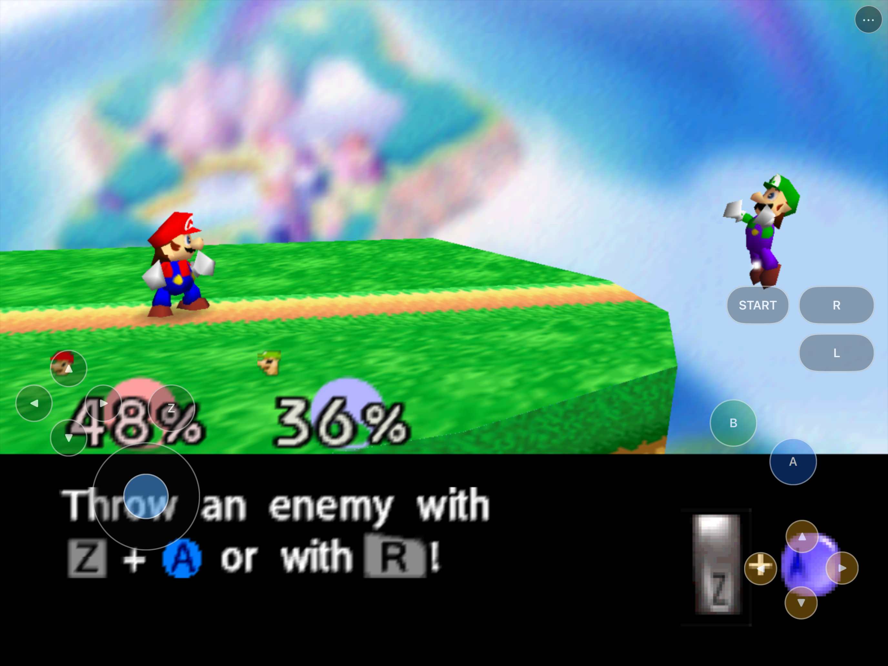
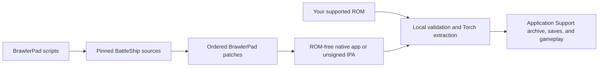

# BrawlerPad

<p align="center">
  <strong>Super Smash Bros. 64 rebuilt as a native Apple-platform port.</strong><br>
  Metal rendering, Files-based ROM setup, physical-controller plumbing, and
  customizable iPhone/iPad touch controls.
</p>

<p align="center">
  
  
  
  
</p>

BrawlerPad is an unofficial native iOS, iPadOS, and Apple Silicon macOS
porting project based on reverse-engineered game code. It is not a
general-purpose Nintendo 64 emulator and is not affiliated with or endorsed by
Nintendo. No ROM or original copyrighted game assets are included. Users must
provide their own legally obtained game data.



The screenshot is from the current iPad Simulator build using locally supplied
game data. Neither that game data nor a playable generated archive is part of
this repository or its packages.

## Install status

| Option | Status | What to do |
|---|---|---|
| Local Apple Silicon macOS app | **Available now** | Run `scripts/build-macos-app.sh`; the ROM-free app prompts for your supported ROM on first launch. |
| iPhone/iPad Simulator | **Available now** | Run `scripts/build-ios-simulator.sh`, install with `simctl`, then select your ROM through Files. |
| Unsigned iPhone/iPad IPA | **Buildable now** | Run `scripts/build-ios-device.sh` and `scripts/package-ios.sh`, then re-sign the audited IPA with your own identity. |
| Signed physical-device build | **Not yet accepted** | Local signing is possible, but the complete hardware test matrix remains open. |
| App Store / TestFlight | **Not announced** | No public store listing or TestFlight exists. |

## Get started

You need an Apple Silicon Mac, Xcode and its command-line tools, the dependencies
listed in [the build guide](docs/BUILDING.md), and your own legally obtained
supported US ROM. Then run:

```sh
git clone https://github.com/chrissotraidis/brawlerpad.git
cd brawlerpad
scripts/clone-sources.sh

# Choose one or more targets.
scripts/build-macos-app.sh
scripts/build-ios-simulator.sh
scripts/build-ios-device.sh
scripts/package-ios.sh
```

All generated source trees, build products, packages, ROMs, and extracted game
archives stay outside Git. Simulator and physical-device installation commands
are documented in [docs/BUILDING.md](docs/BUILDING.md).

## Status

The research phase is complete and the selected game core is
[BattleShip](https://github.com/JRickey/BattleShip). Its pinned upstream build
now compiles and runs natively on Apple Silicon through Metal, validates and
extracts the local reference ROM, completes a deterministic one-minute match,
persists a save, relaunches, and packages as a ROM-free `.app` and DMG.

The initial upstream Metal results-screen regression is fixed by a small,
reproducible BrawlerPad patch. A native arm64 iOS simulator app also now builds,
installs, opens a ROM through Files, validates it, runs Torch extraction
in-process, and launches the Metal-rendered game on an iPhone simulator. The
same bundle has completed Files import, linked extraction, and native Metal
boot on an iPad simulator, with form-factor-aware setup UI. A native,
customizable multi-touch controller now drives the same SDL/ControlDeck path
as physical controllers; iPad testing now covers title/menu navigation,
VS setup, character and stage select, a complete one-minute match and results
return, Classic character selection/live combat/pause, controller auto-hide,
the move/resize/hide/reset editor, and save/settings migration through relaunch
and in-place reinstall. The current Tablet V4 layout restores HarkinianPad's
accepted physical-iPad split: D-pad and stick occupy separate left-thumb zones,
Z sits between them, and Start/R/L, A/B, and the C diamond occupy independent
right-side groups. A separate tall-window profile and lighter idle treatment
prevent the compressed, game-obscuring layout seen in earlier captures. A
follow-up phone V5 pass uses HarkinianPad's physically accepted iPhone
geometry: L and Z return to the left grip, Start/R stay on the upper-right
rail, and compact C/A/B groups sit under the right thumb with visible gaps
between every target. A touch-only iPhone run now covers title,
Mode Select, character and stage select, a one-minute VS match, pause, results,
and return to character select. Short button taps and stick flicks are held
long enough to cross the native game poll boundary, while service coroutines
publish controller state before game logic consumes it.
The same run produced a checksum-valid save with one completed VS battle;
terminate, repeated in-place installs, and relaunch preserved both that save
and the branded configuration.
An isolated iPad negative test also proves the no-resource first-run path and
invalid-ROM handling: a 44-byte `.z64` is rejected with the exact size error,
no archive is created, the user's source remains untouched, and all temporary
picker/import copies are removed.
Three iPad Home/resume cycles preserved the same process, flushed settings,
resumed Metal and touch presentation, and produced no crash report. The app
also passed an iPhone Home/resume cycle with a separately accepted,
non-overlapping phone layout. A native arm64 iPhoneOS build and reproducible
unsigned proof IPA now pass strict ROM/save/signing/personal-data audits. The
bundle contains no ROM or generated playable archive; its only `.o2r` is the
small renderer-shader archive required by Fast3D. A branded arm64
`BrawlerPad.app` and DMG now also build for macOS, carry the BrawlerPad bundle,
runtime, archive, and configuration identity, pass deep ad-hoc signature and
ROM/privacy audits, and show a fully branded ROM-free first-run wizard. A
second checkout reproduces the stripped executable payload, required Mach-O
UUID, Apple CDHash, shader archive, and every non-signature bundle file.

Simulator now also covers synthetic interruption begin/end dispatch, a
low-memory event, and a live host-output switch with non-crashing recovery.
The remaining simultaneous-multitouch matrix, audible OS-generated
interruption/route testing, physical-controller gameplay, and physical-device
testing remain in progress. See
[current status](docs/STATUS.md) and the [implementation plan](docs/PLAN.md)
for exact evidence and remaining work.

## Repository boundary

`ref/` is ignored local storage for upstream research checkouts and a
user-supplied ROM. It is never packaged. Exact upstream revisions are recorded
in [docs/DEPENDENCIES.md](docs/DEPENDENCIES.md) and fetched with:

```sh
scripts/clone-sources.sh
```

The repository safety gate rejects ROMs, extracted archives, applications,
packages, signing material, large generated files, and likely credentials:

```sh
scripts/check-repo-safety.sh
```

## Baseline macOS build

Install the documented tools and libraries, then pass an exact supported US
ROM to the baseline script:

```sh
brew install cmake ninja python@3.11 glew libzip tinyxml2 nlohmann-json spdlog fmt dylibbundler
"$(brew --prefix python@3.11)/bin/python3.11" -m pip install --user Pillow
scripts/build-macos-baseline.sh /absolute/path/to/your/rom.n64
```

The ROM is hash-checked and linked only into the ignored BattleShip research
checkout. It is never copied into this repository's tracked project or an app
package. Full details are in [docs/BUILDING.md](docs/BUILDING.md).

Build and audit the branded, ROM-free macOS package with:

```sh
scripts/build-macos-app.sh
```

This produces ignored `BrawlerPad.app` and `BrawlerPad.dmg` artifacts under
`ref/BattleShip/dist/`. The app is ad-hoc signed, uses bundle identifier
`com.brawlerpad.app.macos`, and prompts for a supported ROM on first launch;
no ROM or playable generated archive is bundled. The build audit verifies the
app, mounts the DMG read-only, and audits the contained app again.

## iPhone and iPad builds

After fetching the pinned sources and patches, build the unsigned arm64 app:

```sh
scripts/build-ios-simulator.sh
```

The resulting `BrawlerPad.app` supports both iPhone and iPad simulator device
families. On first launch, choose your legally obtained supported ROM through
Files; BrawlerPad uses only a temporary validated copy to generate resources
under Application Support, then deletes that copy. See
[docs/BUILDING.md](docs/BUILDING.md) for install and launch commands.

The in-game Settings → Input Mappings page can enable or hide the touch
overlay, change its opacity, and open the layout editor. Phone and tablet
layouts persist separately. A physical controller hides gameplay controls by
default while leaving the native menu button available. Tablet V4 and compact
phone V5 defaults use separate HarkinianPad-derived thumb zones and explicit
D-pad/C-button accessibility labels. On iPad, Z sits between the D-pad and
analog zones while A/B, the C diamond, and the upper shoulder rail remain
visually independent on the right.

Build and audit an unsigned arm64 iPhoneOS app, then create the reproducible
ROM-free proof IPA:

```sh
scripts/build-ios-device.sh
scripts/package-ios.sh
```

The IPA is unsigned by design and must be re-signed with the installer's own
identity before use on a standard physical device. Packaging includes project
rights notices and discovered source/dependency licenses, then reruns the
strict package audit.

## First launch

BrawlerPad never downloads or bundles game data.

1. Launch the app and choose **Select ROM**.
2. Pick your legally obtained supported US ROM through Files or the macOS file
   picker.
3. BrawlerPad copies it into temporary app-controlled storage and validates its
   exact size and hash.
4. Linked Torch generates `BrawlerPad.o2r` under Application Support.
5. The temporary import is deleted and the native Metal game launches.

The supported ROM SHA-1 is
`e2929e10fccc0aa84e5776227e798abc07cedabf`. Invalid files are rejected without
altering the source document or leaving temporary copies behind.

## Touch controls

- **Left:** D-pad, Z, and analog stick in separate iPad thumb zones.
- **Right:** Start/R/L rail, A/B face buttons, and an independent C diamond.
- **Menu:** the persistent `•••` button remains available when gameplay controls
  are hidden.
- **Customize:** Settings → Input Mappings changes opacity and opens the editor
  for move, 70–150% resize, hide/show, reset, and save.
- **Profiles:** phone, landscape tablet, and tall/portrait tablet layouts persist
  separately.
- **Controllers:** gameplay touch controls hide automatically by default when a
  physical controller is connected; this can be disabled.

Every touch target feeds the same normalized SDL/ControlDeck player-one path as
physical controllers. Opening the native menu cancels held input and removes the
gameplay overlay until the menu closes.

## What works

| Area | Current result |
|---|---|
| Native apps | Apple Silicon macOS, arm64 iOS Simulator, and unsigned arm64 iPhoneOS builds pass |
| Rendering | Native Metal reaches menus, character/stage selection, matches, pause, and populated results |
| Game setup | Files picker, exact ROM validation, in-process extraction, cleanup, and local archive mount pass |
| Touch | Complete iPhone and iPad controls, editor, separate profiles, and full single-contact VS flows pass |
| Saves/settings | Creation, relaunch, backgrounding, and repeated in-place app updates preserve valid content |
| Lifecycle | iPhone/iPad foreground recovery plus synthetic interruption and low-memory dispatch pass |
| Packaging | ROM-free macOS app/DMG and deterministic unsigned IPA pass strict privacy/signing audits |

Hardware-only acceptance still covers audible interruption/routes, true
simultaneous multitouch, physical-controller gameplay/reconnect, and signed
iPhone/iPad execution. See [docs/TESTING.md](docs/TESTING.md) for the evidence
boundary rather than inferred platform claims.

## Reproducible and ROM-free



The compile and package steps never read or embed your ROM. The package audits
reject ROM extensions, playable archives, saves, credentials, profiles,
certificates, private keys, personal paths, and unintended generated files.
A fresh remote clone has replayed every pinned source and maintained patch,
then built and audited the macOS app/DMG, arm64 Simulator app, generic arm64
iPhoneOS app, and two byte-identical unsigned IPAs.

## Frequently asked questions

<details>
<summary><strong>Where is the IPA?</strong></summary>

There is no published binary release yet. `scripts/package-ios.sh` creates an
unsigned, ROM-free proof IPA locally. It must be re-signed with your own Apple
identity before installation on a standard device.
</details>

<details>
<summary><strong>Does this repository include the game or a ROM?</strong></summary>

No. You must provide your own legally obtained supported ROM. Do not open issues
requesting game data, generated archives, or download links.
</details>

<details>
<summary><strong>Does audio work?</strong></summary>

The native pipeline initializes at 32 kHz and produces non-zero synthesized
audio. Simulator interruption dispatch and host-output switching recover, but
audible physical-device output and real headphone/Bluetooth interruption tests
remain explicitly open.
</details>

<details>
<summary><strong>Does it support controllers?</strong></summary>

Yes at the architecture and detection level: SDL mappings and the normalized
ControlDeck path are included, and Simulator controller detection/automatic
touch hiding work. Actual physical-controller gameplay and reconnect remain a
hardware acceptance item.
</details>

<details>
<summary><strong>Is this an App Store or TestFlight release?</strong></summary>

No. App Store, TestFlight, AltStore PAL, and other distribution paths require
separate signing, review, account, and release work.
</details>

## Project map

| Path | Purpose |
|---|---|
| [`scripts/clone-sources.sh`](scripts/clone-sources.sh) | Fetch exact upstream pins and replay maintained patches |
| [`scripts/build-macos-app.sh`](scripts/build-macos-app.sh) | Build and audit the Apple Silicon app and DMG |
| [`scripts/build-ios-simulator.sh`](scripts/build-ios-simulator.sh) | Build the universal iPhone/iPad Simulator app |
| [`scripts/build-ios-device.sh`](scripts/build-ios-device.sh) | Build and audit the unsigned arm64 iPhoneOS app |
| [`scripts/package-ios.sh`](scripts/package-ios.sh) | Create and audit the deterministic unsigned IPA |
| [`scripts/check-repo-safety.sh`](scripts/check-repo-safety.sh) | Reject game data, secrets, signing material, and generated products |
| [`patches/`](patches/) | Ordered BrawlerPad changes applied to pinned upstream sources |
| [`docs/PLAN.md`](docs/PLAN.md) | Architecture and milestone plan |
| [`docs/ARCHITECTURE.md`](docs/ARCHITECTURE.md) | Runtime and platform boundaries |
| [`docs/BUILDING.md`](docs/BUILDING.md) | Full build, install, and signing instructions |
| [`docs/TESTING.md`](docs/TESTING.md) | Evidence matrix and explicit acceptance boundaries |
| [`docs/STATUS.md`](docs/STATUS.md) | Current verified state and remaining work |
| [`docs/WORKLOG.md`](docs/WORKLOG.md) | Chronological implementation and test record |
| [`docs/LEGAL.md`](docs/LEGAL.md) | Rights and redistribution boundary |
| [`docs/DEPENDENCIES.md`](docs/DEPENDENCIES.md) | Exact upstream revisions, purposes, and licenses |

Generated source trees, build directories, artifacts, ROMs, and ROM-derived
archives are ignored and must never be committed.

## Contributing and support

Use [GitHub Issues](https://github.com/chrissotraidis/brawlerpad/issues) for
reproducible platform or gameplay defects. Include the platform, device/OS,
commit, build command, observable behavior, and relevant non-sensitive logs.
Never attach or request ROMs, generated playable archives, saves, credentials,
or signing material.

## Legal and acknowledgements

BrawlerPad builds on work by JRickey and BattleShip contributors,
VetriTheRetri and the SSB64 decompilation contributors, the libultraship and
Harbour Masters communities, Torch contributors, SDL contributors, and the
HarkinianPad project. Each dependency retains its own license and rights
boundary. BrawlerPad is not affiliated with or endorsed by Nintendo; all game
names, copyrights, and trademarks belong to their respective owners.
